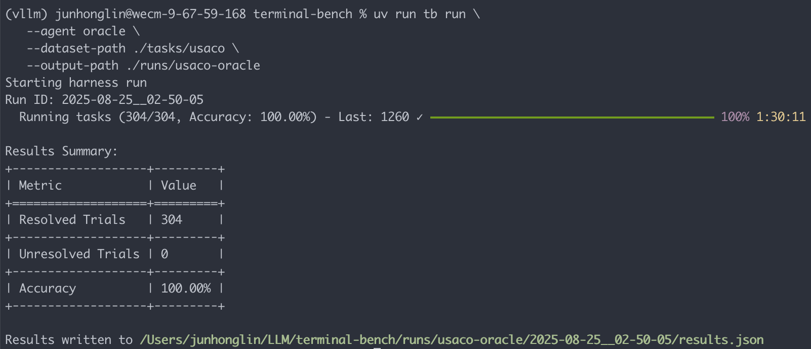

# USACO Adapter: Parity & Oracle Logs

This folder provides evidence that the **USACO adapter** faithfully reproduces
the original benchmark within Terminal-Bench.

We collected three kinds of runs:

1. **Oracle**  
   - Runs the official Python reference solution for each problem (provided by the
     benchmark dataset, not by USACO itself).  
   - Verified that the evaluation judge returns **100% score**.  
   - Evidence: logs in `oracle/` (e.g., `usaco_oracle.png` screenshot + TB logs).
   

2. **Parity Original**  
   - Runs the **original benchmark setup** (outside Terminal-Bench).  
   - Used the original benchmark prompt to query an agent (Codex + `o4-mini` LLM).  
   - Collected the raw generated Python solutions in `parity_original/`.  
   - Note: The original benchmark does **not provide per-problem results**.  
     However, reviewers can reproduce evaluation using the provided
     `codex/scripts/evaluate_codex.sh` script from the [official benchmark repo](https://github.com/junhongmit/USACO-adapter).

3. **Parity Adapter**  
   - Runs the **Terminal-Bench agent** on each problem generated using the **USACO adapter**.  
   - The agent generates `solution.py` files, which are then executed by the
     evaluation judge.  
   - Evidence: TB run logs in `parity_adapter/`.

---

## Results Summary

The table below compares the performance on **original benchmark** vs.
**Terminal-Bench adapter**, averaged across 3 runs.
We also include oracle sanity checks.

| Model              | Original USACO | T-Bench Adapter |
| ------------------ | -------------- | --------------- |
| `oracle`           | 100%           | 100%            |
| `codex-o4-mini`    | 74.70% ± 1.53% | 74.69% ± 0.56%  |

- Oracle evidence is in [`oracle/`](./oracle)  
- Adapter parity logs are in [`parity_adapter/`](./parity_adapter)  
- Original parity generations are in [`parity_original/`](./parity_original)  

